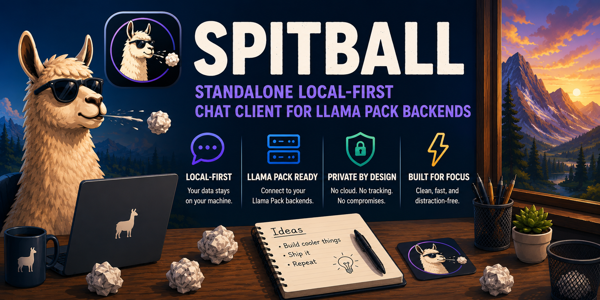

# Spitball

Spitball is a local-first private AI client for Llama Pack. It gives a lighter
standalone chat surface for end users who want to connect to a Llama Pack
controller or agent without opening the full operator UI.

The app is built with Vite, React, TypeScript, and Electron. The browser build
is still useful for frontend development, while the Electron shell adds desktop
storage and macOS keychain-backed credential storage.

## What It Offers

- Streaming private chat through Llama Pack's OpenAI-compatible
  `/v1/chat/completions` endpoint.
- Connection setup checks for discovery, authentication, and usable model
  loading.
- Model and request-type selection from the authenticated client session.
- Optional agent-tool execution with a bounded max-iteration setting.
- Context-budget estimates before sending prompts.
- Local conversation history with editable titles and delete actions.
- Buckets for organizing local conversations.
- Project records with root hints that can sync to controller-backed client
  projects when connected.
- Markdown rendering, GitHub-flavored Markdown, syntax highlighting, and copy
  actions for messages and code blocks.
- Light and dark themes.
- Local JSON export of conversation history.

## Install

Install dependencies for both the web app and desktop shell:

```bash
cd packages/spitball
npm ci
cd desktop
npm ci
```

## Run The Desktop App

From the repository root, run both Vite and Electron with:

```bash
packages/spitball/start_spitball.sh
```

The script starts the Vite app at:

```text
http://127.0.0.1:5174/
```

Then it starts the Electron shell against that local URL. Press `Ctrl-C` in the
terminal to stop both processes.

## Run The Browser App Only

For browser-only frontend development:

```bash
cd packages/spitball
npm run dev
```

Open:

```text
http://127.0.0.1:5174/
```

Browser storage uses IndexedDB for the connection profile, optional remembered
external app key, projects, buckets, and conversations.

## Run The Desktop Shell Manually

The Electron shell attaches to an already-running Spitball Vite app. It does not
start Vite and does not start a Llama Pack backend.

Start the web app first:

```bash
cd packages/spitball
npm run dev
```

Then launch Electron in another terminal:

```bash
cd packages/spitball/desktop
npm run dev
```

By default, Electron loads:

```text
http://127.0.0.1:5174/
```

Override the target URL if Vite is running somewhere else:

```bash
SPITBALL_DESKTOP_URL=http://127.0.0.1:5175/ npm run dev
```

If the target URL is unavailable, the shell shows a local offline page with the
command needed to start the Vite app.

## Desktop Storage

In Electron, Spitball stores local data in:

```text
<Electron userData>/spitball.sqlite3
```

The SQLite database stores profiles, projects, buckets, and conversations. When
you enable "Remember key on this device", the API key is stored separately in
the macOS keychain under the `Spitball` service instead of in SQLite.

The Electron shell is currently macOS-oriented because keychain storage is only
implemented through the macOS `security` command. On other platforms, run the
browser app until platform-specific desktop secret storage is added.

## Connect To Llama Pack

Use a Llama Pack controller URL when possible:

```text
https://pi-controller.local
```

An agent URL can also work when the agent exposes the same client endpoints.
Spitball currently authenticates with an external app key and sends it in:

```text
X-Llama-Pack-Key
```

Create the external app key in Llama Pack, then enter the backend URL and key in
Spitball Settings. Use "Test connection" to populate the session, model list,
and request types.

Spitball uses these backend routes:

- `GET /lm-api/v1/client-discovery`
- `GET /v1/client/session`
- `GET /v1/models`
- `GET /v1/client/projects`
- `POST /v1/client/projects`
- `POST /lm-api/v1/chat/{model}/context-budget`
- `POST /v1/chat/completions`

For browser development, the backend must allow the Vite origin in
`client_cors_origins`, for example:

```yaml
client_cors_origins:
  - "http://localhost:5174"
  - "http://127.0.0.1:5174"
```

Match the actual port printed by Vite.

## Projects And Agent Tools

Projects are saved locally and, when connected to a controller, are also created
through `/v1/client/projects`. A project root is only a hint until the
corresponding Llama Pack agent allows that path in `agent_tools.safe_roots`.

To use the "Agent tools" toggle in chat:

1. Enable agent tools on the selected Llama Pack node.
2. Configure a tool catalog/profile for that node.
3. Add the project root to `agent_tools.safe_roots`.
4. Select a project in Spitball before sending tool-backed prompts.

Spitball sends `tool_runtime: "agent"` and `agent_tool_max_iterations` with chat
requests when the toggle is enabled.

## Scripts

From `packages/spitball`:

```bash
npm test
npm run typecheck
npm run build
```

From `packages/spitball/desktop`:

```bash
npm test
```

## Development Notes

- `Enter` sends a message.
- `Shift+Enter` inserts a newline.
- Right-click conversations to edit titles, delete them, or move them into
  buckets.
- Right-click messages and rendered code blocks to copy content.
- Use "Export local archive" in Settings to download a JSON conversation export.
